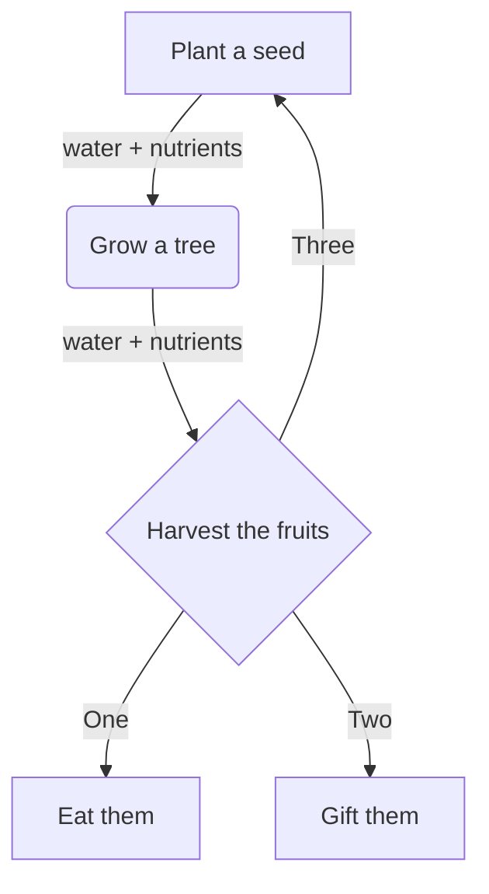

# flowchart
# test test

```mermaid
flowchart TD
    A[Plant a seed] -->|water  + nutrients| B(Grow a tree)
    B --> |water  + nutrients| C{Harvest the fruits}
    C -->|One| D[Eat them]
    C -->|Two| E[Gift them]
    C -->|Three| A[Plant a seed]
```
